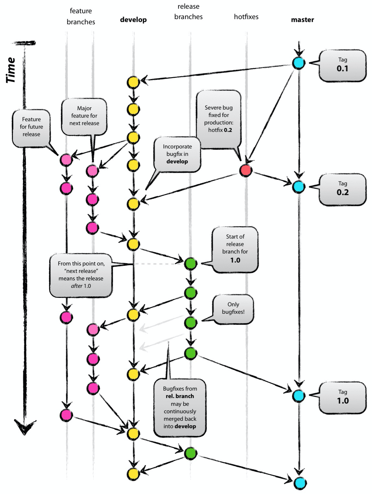

# Through
###finish the following git structure.

develop 1
develop 2
develop 3

Feature for future release 1.
Feature for future release 2.
Feature for future release 3.
Feature for future release 4.